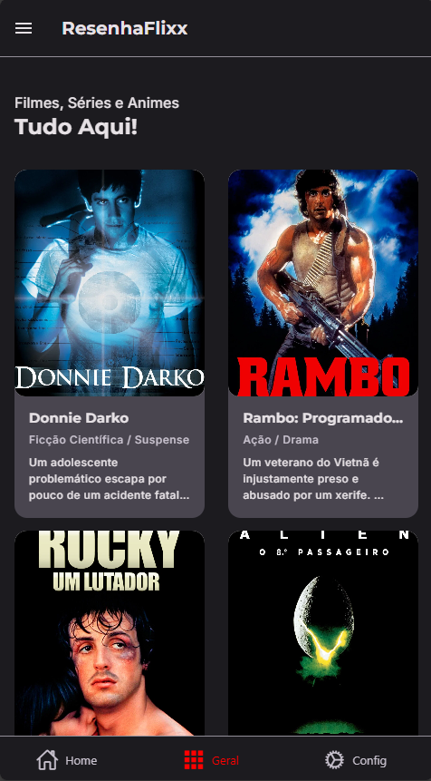
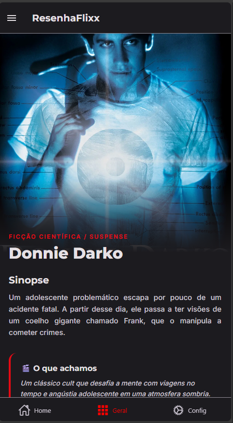
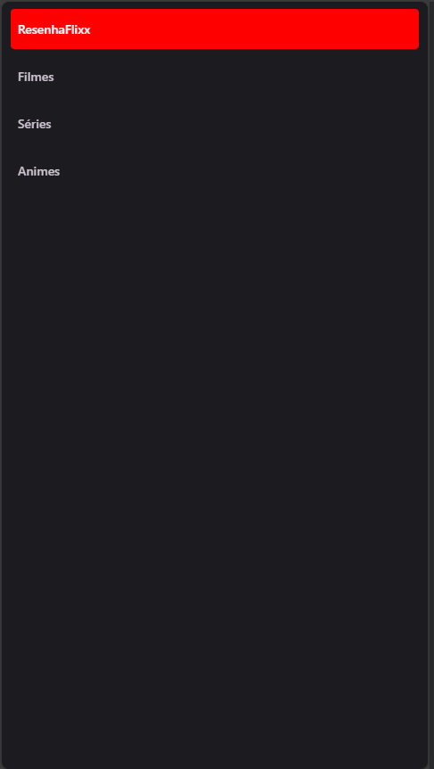
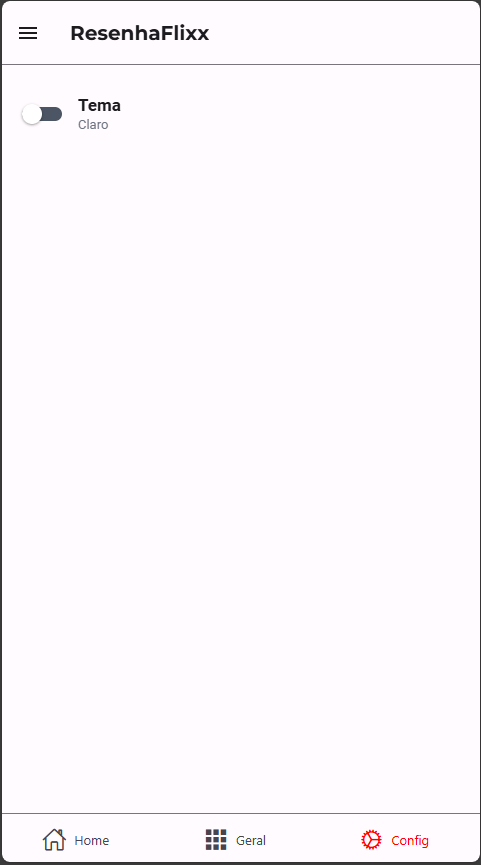
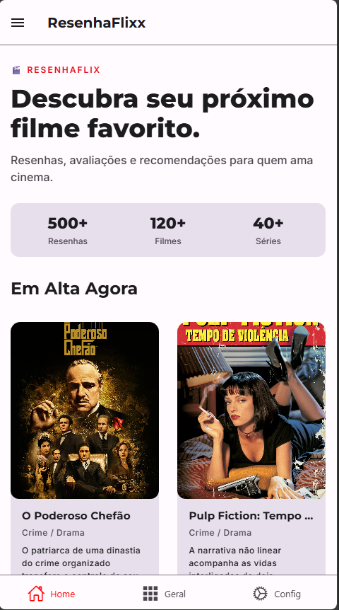

# RESENHA FLIX

Este é um projeto feito para um trabalho de PAM na etec Fernando Prestes.

O app consiste em um simples "letterboxd" de resenhas únicas para filmes, séries e animes.   
  O aplicativo possui temas escuro e claro, abas separadas em categorias, desing minimalista e sofisticado.

## Linguagem usada

- JavaScript
- React Native Framework
- Expo

## Imagens do projeto

  
 
 
 
 
 
